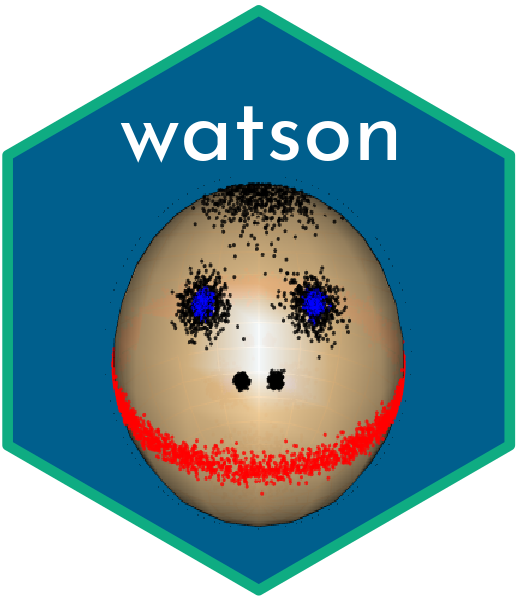

<div align="center">
  

  # watson

  [](https://www.r-project.org/)
  [](https://isocpp.org/)
  [](http://arma.sourceforge.net/)
  [](https://cran.r-project.org/package=watson)
  [](https://opensource.org/licenses/GPL-3.0)
  [](https://github.com/lsablica/watson/actions/workflows/rhub.yaml)

  *A high-performance computational framework for the Watson distribution and its mixtures.*

  [Key Features](#key-features) •
  [Project Overview](#project-overview) •
  [Installation](#installation) •
  [Citation](#citation)
</div>

---

## Key Features

🚀 **State-of-the-Art Statistical Modeling**
- Designed for axial data on high-dimensional spheres.
- Fit mixtures of Watson distributions with ease using an optimized Expectation-Maximization (EM) algorithm.

🧠 **Built on Rigorous Mathematics**
- Powered by theoretical work on bounds for Kummer’s function and its derivatives:
  - Sablica & Hornik (2022): ["On bounds for Kummer’s function ratio"](https://www.ams.org/journals/mcom/2022-91-334/S0025-5718-2021-03690-X/).
  - Sablica & Hornik (2024): ["Family of integrable bounds for the logarithmic derivative of Kummer’s function"](https://www.sciencedirect.com/science/article/pii/S0022247X24001847?via%3Dihub).

⚡ **Speed**
- Heavy lifting implemented in C++ using Armadillo, delivering unmatched computational performance.
- Efficient handling of sparse matrices and large-scale data.

📊 **Advanced Statistical Features**
- Supports custom initialization and dynamic elimination of small clusters.
- Automated selection of optimal rejection sampling algorithms based on parameters.

📖 **Comprehensive Documentation**
- Full documentation and examples are available, with the package paper under review in the *Journal of Statistical Computing*.

## Project Overview

`watson` is the go-to R package for modeling and analyzing axial data using the Watson distribution. It provides researchers, data scientists, and statisticians with the tools needed to:

- Simulate data from Watson distributions and their mixtures.
- Fit complex models to high-dimensional axial data.
- Accurately estimate parameters using robust numerical methods.

### Why Axial Data?
Axial data are unit vectors on a sphere where directions are indistinguishable (e.g., $x$ and $-x$ are equivalent). These data arise naturally in fields such as:

- **Structural Geology**: Modeling rock magnetism or fault planes.
- **Biostatistics**: Analyzing molecular orientations.
- **Machine Learning**: Embedding spaces and sentiment analysis.

With `watson`, you can unlock the full potential of axial data, leveraging a framework that combines theoretical results with computational power.


## Installation

The package is available on CRAN:

```R
install.packages("watson")
```

## Citation

If you use `watson` in your research, please cite:

```bibtex
@article{watson2025,
  title = "{watson: An {R} Package for Fitting Mixtures of {Watson} Distributions}",
  author = {Lukas Sablica and Kurt Hornik and Josef Leydold},
  journal = {Journal of Statistical Software},
  year = 2025,
  note = {Accepted for publication}
}
```

---


